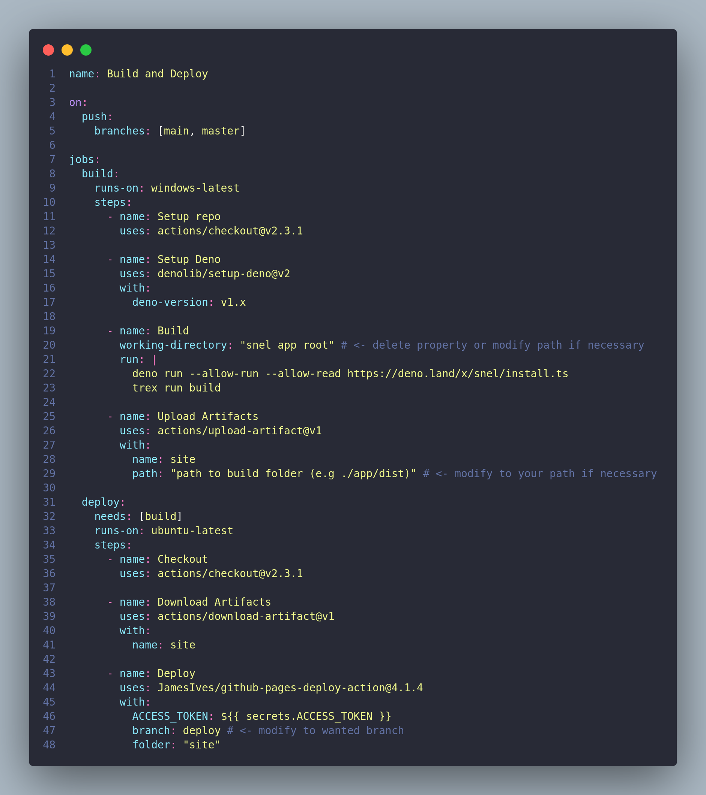

# Snel Workflow

## General

[This workflow](.github/workflows/snel.yml) is designed to automatically publish your snel generated Web-Page to GitHub-Pages.

## Consider to modify

### In the Build step

- working-directory: ./{path to snel app root (where your run.json lies)}
If your root-directory is the snel generated folder, you can delete this line.

### In the Upload Artifacts step

- path: ./{path to generated dist (should be in your snel app root)}

### In the Deploy step

- branch: {branch you want to deploy on}

